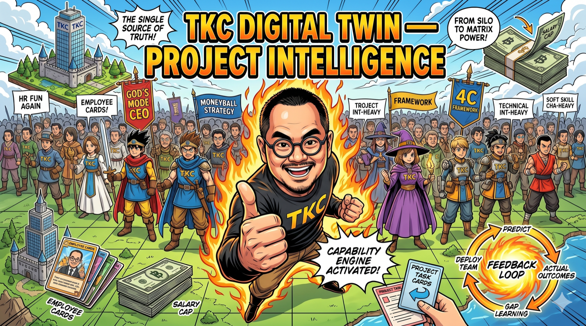

# TKC Digital Twin — Talent Support System

**A gamified organizational operating system built for a mid-size technology company.**  
Not a dashboard. Not a training program. A living mechanism for talent transformation.

> *"The numbers are not truth. They are a compass."*

---

## Why This Exists

A well-established, publicly listed technology company asked a consultant to return and deliver another round of design thinking workshops. Two years earlier, the same consultant had run similar sessions, yet little had changed. The HR director admitted that despite numerous upskilling programs, employees remained disengaged, siloed, and reluctant to speak up. Leadership knew something was wrong, but kept applying the same remedy — more training, more courses, more hope.

During a series of candid conversations with the CEO, board members, and HR leaders, a deeper pattern emerged. The organization was not failing because its people lacked skills. It was failing because its entire operating system — a rigid, top-down, project-based structure — actively prevented people from growing, collaborating, or finding joy in their work. Talented employees left not for higher salaries alone, but because they saw no future. Underperformers were kept indefinitely out of misplaced loyalty, creating stagnation. Knowledge vanished when projects ended. Innovation remained accidental.

The proposal was different: instead of more workshops, embed for six months — not to teach, but to build. Form cross-functional squads that solved real problems. Prototype new ways of working. Design a new organizational operating system from the ground up.

---

## The Philosophy

This project attempts to transform HR from a bureaucratic, reactive function focused on hiring, firing, and compliance — a role that both employees and HR professionals dread — into a **Talent Support system** that is proactive, creative, and genuinely fun.

Traditional consulting firms deliver thick binders of recommendations and then leave. This project does the opposite: it embeds, builds, and leaves behind a **living system**.

### The Three Big Ideas

| Idea | What it means |
|------|---------------|
| **HR Fun Again** | Gamification makes HR a strategy game, not paperwork. Directors compete for talent. Teams form like parties. |
| **God's Mode** | The CEO sees the entire company as a digital twin — who works with whom, where the skill gaps are, which teams have chemistry — without delegating the view to middle management. |
| **Moneyball** | You can't afford all superstars. The salary cap forces smart allocation. Find undervalued talent. Build chemistry instead of buying stars. |

### Why RPG Mechanics Work

Drawing inspiration from *Dragon Quest III* (Famicom, 1988), the system treats every employee as a hero on a journey:

- **Party formation** — cross-functional squads built for balance, not just headcount
- **Class changes** — career rotations (Alltrades Abbey) that preserve institutional memory while building new capabilities
- **Experience points** — earned from real achievements, not from sitting in mandatory training
- **Vital signs** — HP, MP, Form, and morale as real signals, not vanity metrics
- **Salary cap** — project budget ÷ 10 = monthly ceiling; 1 CP = ฿1,000/month

The pixel characters are not decoration. They are the soul of the system — they make data feel human.

---

## The 4C Framework — Why People Work

Every feature in this system traces back to one of four motivation drivers:

| Driver | What it means | When it breaks |
|--------|---------------|----------------|
| **Compensation** | Money / survival. The hygiene baseline. | If too low, nothing else matters (Herzberg). |
| **Cause** | Story / dignity. Meaningful work. Purpose beyond the job description. | When people can't answer "why does this matter?" |
| **Career** | Flow / fun. Growth. When work isn't work (Csikszentmihalyi). | When challenge ÷ skill ratio is wrong — too easy or too hard. |
| **Community** | Belonging. Social connection. Being known as a person, not a headcount. | When teams are assembled without chemistry. |

The system does not optimize for any single driver. It surfaces the gaps — and gives leaders the tools to address them.

---

## Game Mechanics

### The Feedback Loop (the killer feature)

```
Form a team → predict score (chemistry, fit, budget)
    ↓
Deploy the team → project runs
    ↓
Record actual outcomes (on-time? budget? quality?)
    ↓
Compare prediction vs reality — the GAP is where learning happens
    ↓
Over time: directors learn which compositions actually work
```

### Scoring

```
Points = base × margin_multiplier × chemistry_multiplier × budget_multiplier

Margin:    >20% → 1.5×   |  18–20% → 1.2×   |  <18% → 0.8×   |  <12% → 0.5×
Chemistry: >75  → 1.3×   |  avg    → 1.0×   |  <55   → 0.7×
Budget:    under cap → 1.1×   |  over cap → 0.7×
```

### RPG Character Classes

| Class | Stat | HR Equivalent |
|-------|------|---------------|
| **Hero** (Captain) | Balanced | Strategic generalist, team anchor |
| **Soldier** (Ops) | STR | Execution, delivery, closing |
| **Wizard** (Tech) | INT | Analysis, systems thinking, engineering |
| **Pilgrim** (Scout) | WIS | Experience, judgment, cross-functional range |
| **Merchant** (Sales) | CHA | Influence, client relations, negotiation |

### Team Chemistry Components

- **Skill coverage** — does the team's combined profile match the project's demands?
- **Personality balance** — OCEAN traits; groupthink risk when too homogeneous
- **Cognitive diversity** — range of perspectives, not just technical coverage
- **Party order** — front row (captain) + back row (support) earns +5 chemistry bonus
- **Social loafing risk** — ~7% per additional member beyond optimal team size

---

## What's Built

| Module | Description |
|--------|-------------|
| **Formation Board** | Drag-and-drop team assembly with live salary cap, chemistry score, and skill fit |
| **Hero Cards (Roster)** | Every employee as a collectible card with ICA Index, OCEAN traits, and procedural DQ3 sprite |
| **Gallery Mode** | "Heroes of Alefgard" — full DQ3 sprite roster with class filtering and inspect modal |
| **Ninja Tab** | Skill-weighted team builder with readiness matrix |
| **Matrix Tab** | Capability heatmap — org skill supply vs project demand |
| **Signals Tab** | Company intelligence — derived strategic signals from operational data |
| **Lobby** | Check-in world with pixel characters; morale and availability signals |
| **Tome** | Individual employee profile page (server-rendered, printable) |
| **Report Suite** | 10-page e-report with live data + whitepaper + print back cover |
| **Audit Log** | Every stat adjustment and game balance change tracked with timestamp |
| **Sheets Mirror** | Every write to Postgres fires a shadow copy to Google Sheets (the "battery save") |

---

## Architecture

```
ROM chip    → Next.js 16 + React 19 + TypeScript 5 (game rules, sprites)
Save RAM    → Neon PostgreSQL, Singapore region (source of truth)
Memory card → Google Sheets (human-readable shadow mirror)
```

| Layer | Technology |
|-------|-----------|
| Framework | Next.js 16 + React 19 + TypeScript 5 |
| Styling | Tailwind v4 + CSS design tokens |
| Database | Neon PostgreSQL (serverless, `@neondatabase/serverless`) |
| Pixel Art | Canvas-rendered 16×16 procedural DQ3 sprites (seeded RNG from employee ID) |
| Fonts | JetBrains Mono · Press Start 2P · IBM Plex Sans Thai |
| Deployment | Fly.io (Singapore, `tkc-digital-twin.fly.dev`) |

---

## Design Principles

**"Jony Ive meets Dieter Rams"** — clarity, simplicity, elegance.

- Zero rounded corners. Zero gradients. Zero drop shadows. Sharp geometry only.
- Every number explains itself. The system teaches you as you use it.
- Compass, not judgment. Fitness tracker, not social credit.
- The Warhol Principle: the same card template repeated for every employee. The repetition IS the aesthetic. A wall of 200 employee cards IS the company.
- Numbers are directional, not absolute. They show trends. They are not truth.

---

## Psychology Behind the Mechanics

| Theory | Application in this system |
|--------|---------------------------|
| Self-Determination Theory | Autonomy (choose quests), Competence (skill growth), Relatedness (community) |
| Herzberg Hygiene-Motivation | If Compensation < threshold, other motivators grey out |
| Csikszentmihalyi Flow | Challenge ÷ skill ratio calibrates quest difficulty |
| Belbin Team Roles | Teams need Action + People + Thinking balance |
| Tuckman Stages | New teams must storm before performing; some friction is healthy |
| Prospect Theory | Many small celebrations > one big annual award |
| Google Project Aristotle | Psychological safety is #1 predictor of team success |
| Groupthink (Janis) | High cohesion + low dissent + uniform personalities → warning flag |

---

## Running Locally

```bash
# Install
npm install

# Configure environment
cp .env.example .env.local
# Set DATABASE_URL (Neon PostgreSQL connection string)

# Run migrations
DATABASE_URL="..." npx tsx db/migrate.ts

# Start dev server
npm run dev
# → http://localhost:3000
```

### Environment Variables

| Variable | Purpose |
|----------|---------|
| `DATABASE_URL` | Neon PostgreSQL connection string |
| `DASHBOARD_PASSWORD` | Site-wide access gate (leave unset for local dev) |
| `GOOGLE_SERVICE_ACCOUNT_EMAIL` | Sheets mirror (optional) |
| `GOOGLE_PRIVATE_KEY` | Sheets mirror (optional) |
| `GEMINI_API_KEY` | AI chat assistant (optional) |

---

## Data Notice

All employee names, financial figures, and project data in this repository are **representative placeholders**. No real employee data has been committed. TKC = Talent Knowledge Collaborative.

---

## Live Demo

**[tkc-digital-twin.fly.dev](https://tkc-digital-twin.fly.dev)** · Password-protected · Singapore region

---

*Built by Dr. Non Arkaraprasertkul · Independent Consultant*  
*May 2026 · Phase 1 of an ongoing embedded engagement*
